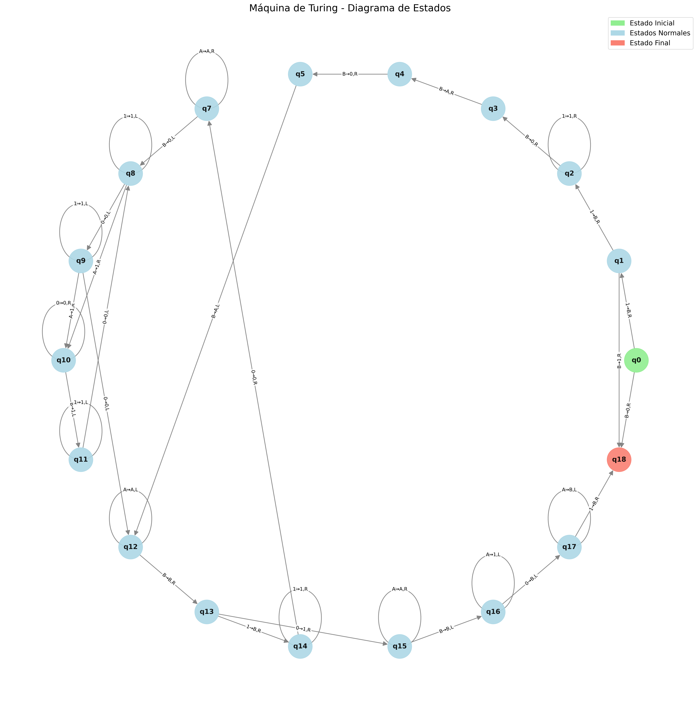

# TM Fibonacci
---
- Christian Echeverría 221441
- Gustavo Cruz 22779
---

## Ejecución
Para ejecutar el proyecto es necesario contar con Python 3.12 en adelante, o Docker. Adicionalmente, contar con un archivo **tm_conf.json** para brindar a la Turing Machine de una configuración específica.
*Ejecución: Python*
```sh
python main.py
```
*Ejecución: Docker*
```sh
docker buildx build -t fibonacci .
docker run -it --rm -v "$(pwd)/images:/fibonacci/images" -e TERM=xterm fibonacci
```
---
## Convenciones

- Representación de los números en la cinta:
    - El número 0 se representará como 0.
    - El número n se representará como n repeticiones del símbolo 1 (por ejemplo, 11 para 2, 111 para 3, etc.).

- Símbolo en blanco:
    - Usaremos B como el símbolo en blanco en lugar de un espacio vacío.

- Ubicación en la cinta:
    - La entrada se colocará al inicio de la cinta.
    - La máquina podrá escribir nuevos valores a la derecha según lo necesite para calcular Fibonacci.

- Formato del archivo de configuración **tm_conf.json**:
    - Q: Conjunto de estados de la máquina.
    - Σ: Alfabeto de entrada (0 y 1).
    - Γ: Alfabeto de la cinta (0, 1, A, B).
    - S: Estado inicial.
    - b: Símbolo en blanco (B).
    - F: Estados finales.
    - transitions: Mapa de transiciones con la forma {Estado: {Símbolo: [Nuevo Estado, Nuevo Símbolo, Dirección]}}.

## Diagrama de TM



## Video Demostrativo de Ejecucion

[](https://youtu.be/ECH0pBYLDiY)
